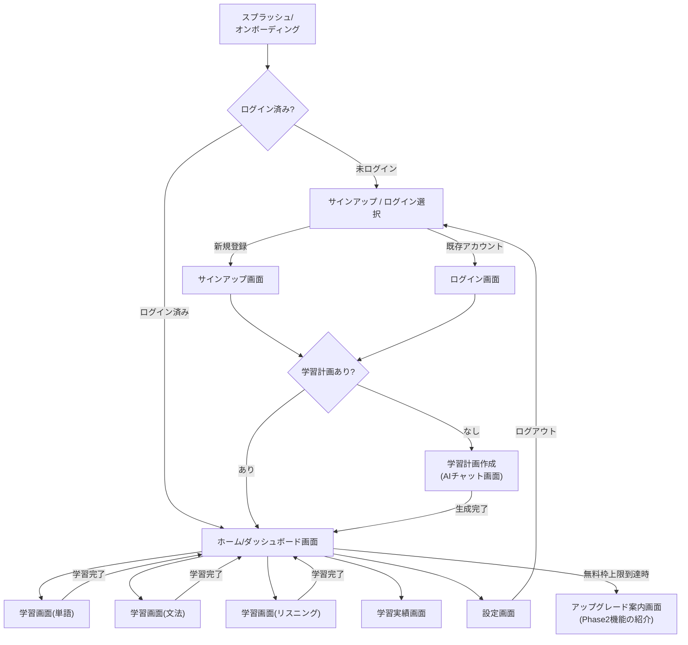
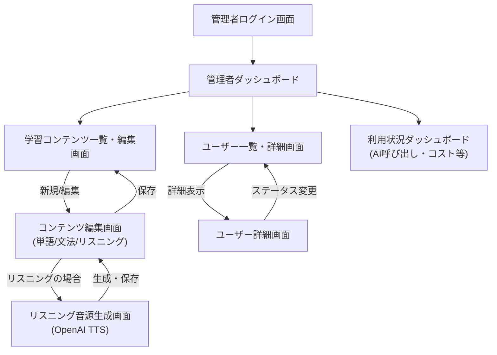
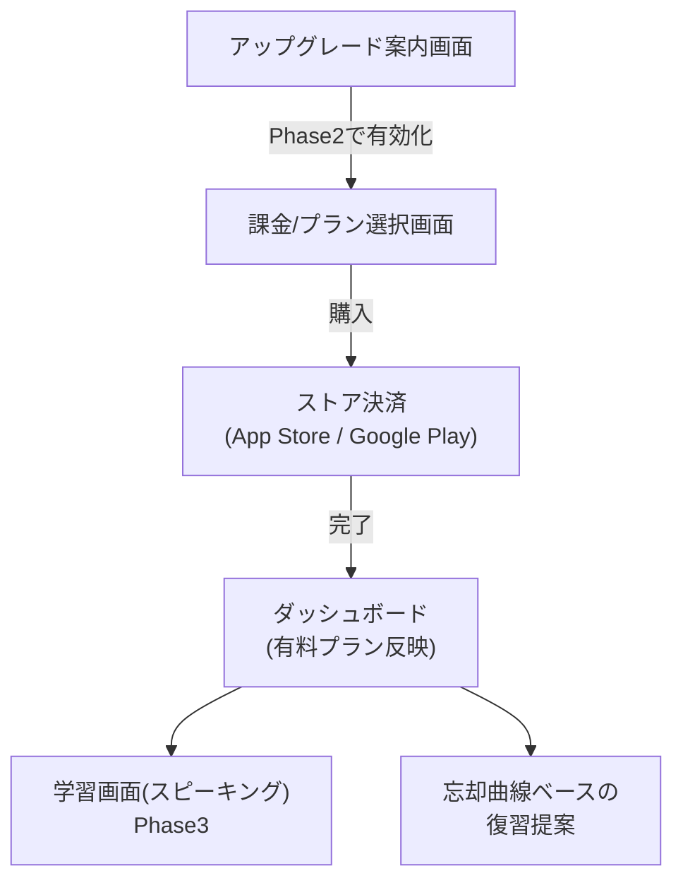

# 画面遷移設計

`requirements_supplementary.md` の「5. 画面一覧」を元に、画面間の遷移関係を図示する。Mermaid記法で記載しているため、対応するビューア(GitHub、多くのMarkdownエディタ等)でそのままフローチャートとして表示できる。

---

## 1. エンドユーザー向け画面遷移(MVP)

## 2. システム管理者向け画面遷移(MVP)

## 3. Phase 2以降の追加遷移(参考)

---

## 4. 画面遷移設計の補足

- **未ログイン時のガード**: `AuthGate` は実装上、Expo Router等のミドルウェア/認証ガードで実現する想定。Supabase Authのセッション状態を見て未ログインなら `SignupOrLogin` にリダイレクトする
- **学習計画の有無判定(`PlanCheck`)**: サインアップ/ログイン直後、ユーザーに有効な `learning_plans`(status = 'active')が存在するかを確認し、なければ強制的に学習計画作成フローに誘導する
- **無料枠上限の判定**: `profiles.plan_generation_count` が1以上、かつ新しい計画を作ろうとした場合に `UpgradeInfo` へ誘導する(MVPでは購入導線はなく案内のみ)
- **管理者と一般ユーザーの認証分離**: `admins` テーブルの有無で権限判定を行う。同一のSupabase Auth基盤を使うが、管理者向け画面群は別途ルーティングを分離し、`is_admin()` のようなチェックをルートガードに組み込む
